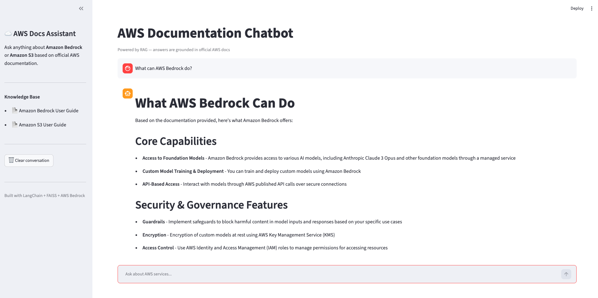
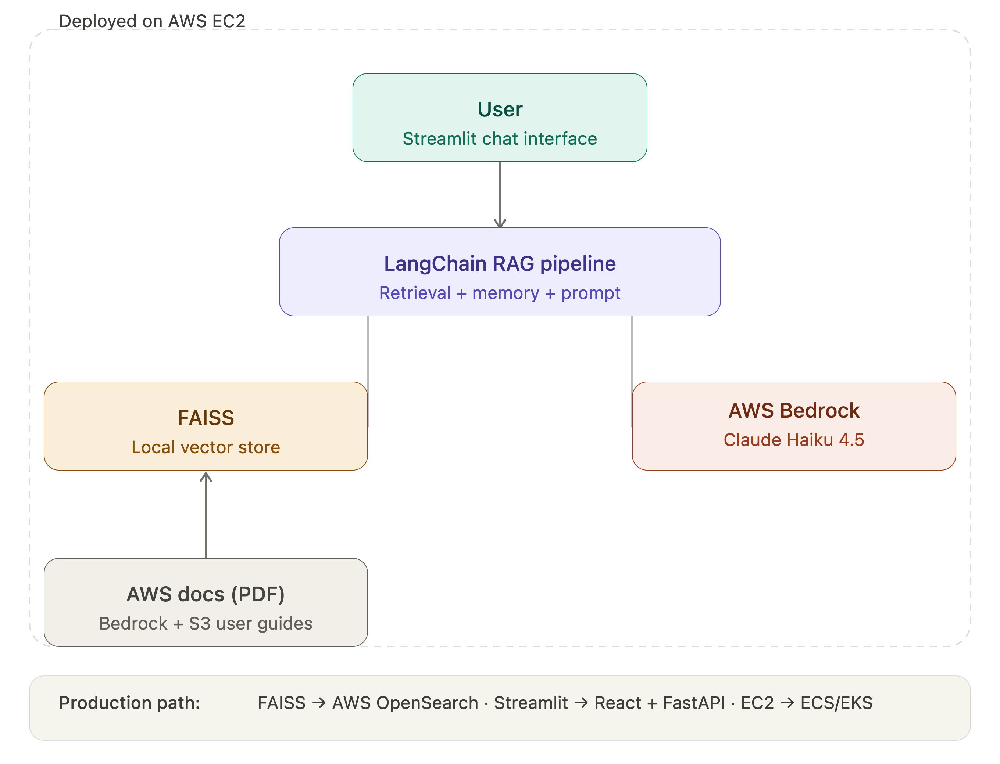
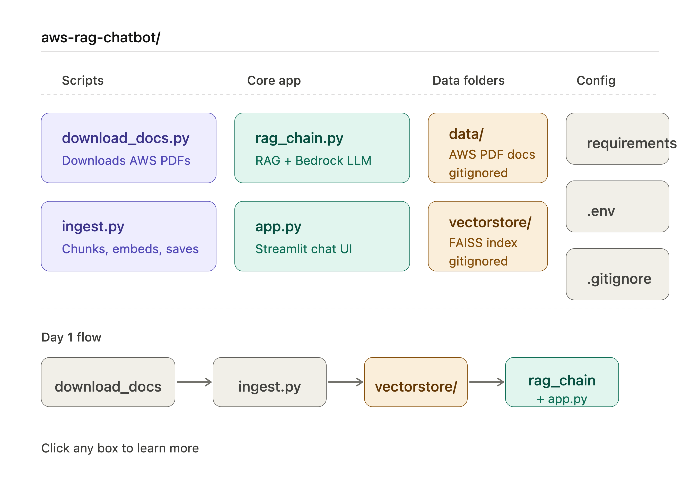

# AWS Documentation RAG Chatbot

A GenAI-powered chatbot that answers questions about AWS services using Retrieval-Augmented Generation (RAG), powered by AWS Bedrock (Claude Haiku 4.5).

Built as a Solutions Architect portfolio PoC — demonstrating how enterprises can make internal documentation instantly queryable through natural language.

## Live Demo

> Ask anything about Amazon Bedrock or S3 in natural language. The chatbot retrieves relevant content from official AWS documentation and generates grounded, cited answers.



## Architecture



**Production upgrade path:**

- FAISS → AWS OpenSearch
- Streamlit → React + FastAPI
- EC2 → ECS / EKS

## Tech Stack

| Layer          | Technology                     |
| -------------- | ------------------------------ |
| LLM            | AWS Bedrock — Claude Haiku 4.5 |
| RAG Framework  | LangChain                      |
| Vector Store   | FAISS (local)                  |
| Embeddings     | OpenAI text-embedding-3-small  |
| UI             | Streamlit                      |
| Knowledge Base | AWS Documentation PDFs         |
| Knowledge Base | AWS Documentation PDFs         |

## Features

- Natural language Q&A over AWS documentation
- Multi-turn conversation with memory
- Source citation for every answer
- Graceful handling of out-of-scope questions
- Powered by AWS Bedrock (Claude Haiku 4.5)

## Setup

### 1. Clone and install

```bash
git clone https://github.com/YOUR_USERNAME/aws-rag-chatbot.git
cd aws-rag-chatbot
python3 -m venv venv
source venv/bin/activate
pip install -r requirements.txt
```

### 2. Set environment variables

```bash
cp .env.example .env
# Add your OPENAI_API_KEY (for embeddings)
```

### 3. Configure AWS credentials

```bash
aws configure
# Add your AWS Access Key, Secret, and set region to us-east-1
```

### 4. Download AWS documentation

```bash
python scripts/download_docs.py
```

### 5. Ingest and embed documents

```bash
python scripts/ingest.py
```

### 6. Run the chatbot

```bash
streamlit run app.py
```

## Project Structure



## Business Use Cases

This pattern is applicable to any enterprise with large document volumes:

- Internal knowledge base & employee Q&A
- Legal & compliance document search
- Product technical support automation
- HR policy & onboarding assistant

## Author

Built in 5 days as a Solutions Architect PoC.
